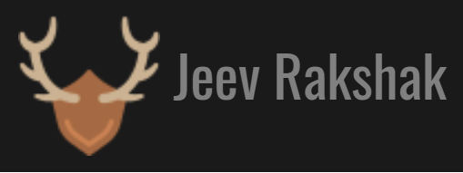

# 🦁 Animal Detection - Wildlife Species Identification

<div align="center">



**AI-Powered Wildlife Species Detection & Classification**

[](https://reactjs.org/)
[](https://www.tensorflow.org/js)
[](LICENSE)

[Live Demo](https://ume2004.github.io/Animal-Detection) • [Report Bug](https://github.com/ume2004/Animal-Detection/issues) • [Request Feature](https://github.com/ume2004/Animal-Detection/issues)

</div>

---

## 📋 Table of Contents

- [About](#-about)
- [Features](#-features)
- [Demo](#-demo)
- [Tech Stack](#-tech-stack)
- [Getting Started](#-getting-started)
- [Project Structure](#-project-structure)
- [Models](#-models)
- [Usage](#-usage)
- [Training](#-training)
- [Contributing](#-contributing)
- [License](#-license)
- [Acknowledgments](#-acknowledgments)

---

## 🌟 About

**Animal Detection** is a cutting-edge web application that leverages deep learning to identify and detect wildlife species in real-time. Built with React and TensorFlow.js, the application runs entirely in the browser, providing instant predictions without requiring server-side processing.

### Why Animal Detection?

- 🔬 **Research Support**: Helps biology researchers analyze camera trap images from wildlife habitats
- ⚡ **Real-time Processing**: Achieves 30+ FPS on modern devices
- 🌐 **Browser-Based**: No installation required - runs completely client-side
- 🎯 **High Accuracy**: 96% detection accuracy with bounding box predictions
- 🦋 **Multi-Species**: Identifies 11 different animal species

---

## ✨ Features

### 🖼️ Image Classification
- Upload images for instant species identification
- Powered by **MobileNetV2** architecture
- Confidence scores for each prediction
- Support for multiple image formats

### 🎯 Object Detection
- Real-time bounding box detection
- **SSD + MobileNetV2** model architecture
- Multiple animal detection in single image
- Precise location mapping

### 📹 Real-time Detection
- Live webcam feed analysis
- Video file processing
- Frame-by-frame species tracking
- 30+ FPS performance

### 🎨 Modern UI/UX
- Nature-inspired wildlife theme
- Responsive design for all devices
- Smooth animations and transitions
- Intuitive drag-and-drop interface

---

## 🎬 Demo


### Supported Species

The model can identify the following 11 species:

| Species | Icon | Species | Icon |
|---------|------|---------|------|
| 🦋 Butterfly | 🐘 Elephant | 🐯 Tiger | 🦁 Lion |
| 🐴 Horse | 🐼 Panda | 🐻 Bear | 🐵 Monkey |
| 🐕 Dog | 🦌 Deer | 👤 Human | |

---

## 🛠️ Tech Stack

### Frontend
- **React.js** - UI framework
- **TensorFlow.js** - Machine learning in the browser
- **Bootstrap** - Responsive design
- **Owl Carousel** - Image sliders
- **AOS** - Scroll animations

### Machine Learning
- **MobileNetV2** - Image classification backbone
- **SSD (Single Shot Detector)** - Object detection
- **Keras** - Model training
- **Google Colab** - Training environment

### Development Tools
- **Create React App** - Project scaffolding
- **npm** - Package management
- **Git** - Version control
- **GitHub Pages** - Deployment

---

## 🚀 Getting Started

### Prerequisites

- **Node.js** (v12 or higher)
- **npm** (v6 or higher)
- Modern web browser (Chrome, Firefox, Safari, Edge)

### Installation

1. **Clone the repository**
   ```bash
   git clone https://github.com/ume2004/Animal-Detection.git
   cd Animal-Detection
   ```

2. **Navigate to the web app directory**
   ```bash
   cd web_app
   ```

3. **Install dependencies**
   ```bash
   npm install
   ```

4. **Start the development server**
   ```bash
   npm start
   ```

5. **Open your browser**
   ```
   Navigate to http://localhost:3000
   ```

### Build for Production

```bash
npm run build
```

This creates an optimized production build in the `build` folder.

### Deploy to GitHub Pages

```bash
npm run deploy
```

---

## 📁 Project Structure

```
Animal-Detection/
├── web_app/                    # React web application
│   ├── public/
│   │   ├── classification/     # MobileNetV2 model files
│   │   ├── detection/          # SSD model files
│   │   ├── css/                # Stylesheets
│   │   ├── js/                 # JavaScript libraries
│   │   ├── imgs/               # Images and logos
│   │   ├── icons/              # Feature icons
│   │   └── index.html          # Main HTML file
│   ├── src/
│   │   ├── components/
│   │   │   ├── classification/ # Classification components
│   │   │   ├── detection/      # Detection components
│   │   │   ├── Classify.js     # Classification page
│   │   │   ├── Detect.js       # Detection page
│   │   │   └── Landing.js      # Landing page
│   │   ├── App.js              # Main app component
│   │   └── index.js            # Entry point
│   └── package.json            # Dependencies
├── train/                      # Training notebooks
│   ├── image_classification.ipynb
│   └── object_detection.ipynb
├── templates/                  # Project assets
│   ├── logo.png
│   ├── demo.gif
│   ├── ic.png
│   └── od.png
├── LICENSE                     # License file
└── README.md                   # This file
```

---

## 🧠 Models

### Image Classification Model

- **Architecture**: MobileNetV2
- **Input Size**: 224x224x3
- **Output**: 11 classes
- **Model Size**: 8.6 MB
- **Accuracy**: ~94%
- **Framework**: TensorFlow/Keras

### Object Detection Model

- **Architecture**: SSD + MobileNetV2
- **Input Size**: 300x300x3
- **Output**: Bounding boxes + class labels
- **Model Size**: 6 MB
- **Accuracy**: ~96%
- **FPS**: 30+ on modern devices

### Model Storage

Models are stored in IndexedDB after first load for faster subsequent access:
- `indexeddb://animal_classifier` - Classification model
- `indexeddb://animal_detector` - Detection model

---

## 💻 Usage

### Image Classification

1. Click on **"Image Classification"** section
2. Click **"Load Model"** (8.6 MB download on first use)
3. Choose input method:
   - **Image**: Upload a photo
   - **Realtime**: Use webcam
   - **Video**: Upload a video file
4. View predictions with confidence scores

### Object Detection

1. Click on **"Object Detection"** section
2. Click **"Load Model"** (6 MB download on first use)
3. Choose input method:
   - **Image**: Upload a photo
   - **Realtime**: Use webcam
   - **Video**: Upload a video file
4. View bounding boxes around detected animals

### Tips for Best Results

- ✅ Use clear, well-lit images
- ✅ Ensure animals are clearly visible
- ✅ Avoid heavily cropped or blurry images
- ✅ For webcam, ensure good lighting
- ⚠️ Model only detects trained species

---

## 🎓 Training

Training notebooks are available in the `train/` directory:

### Image Classification Training

```bash
# Open in Google Colab
train/image_classification.ipynb
```

**Steps:**
1. Prepare dataset with 11 animal classes
2. Data augmentation and preprocessing
3. Transfer learning with MobileNetV2
4. Fine-tuning and optimization
5. Convert to TensorFlow.js format

### Object Detection Training

```bash
# Open in Google Colab
train/object_detection.ipynb
```

**Steps:**
1. Annotate images with bounding boxes
2. Prepare TFRecord dataset
3. Train SSD + MobileNetV2 model
4. Evaluate on validation set
5. Convert to TensorFlow.js format

---

## 🤝 Contributing

Contributions are what make the open-source community amazing! Any contributions you make are **greatly appreciated**.

### How to Contribute

1. **Fork the Project**
2. **Create your Feature Branch**
   ```bash
   git checkout -b feature/AmazingFeature
   ```
3. **Commit your Changes**
   ```bash
   git commit -m 'Add some AmazingFeature'
   ```
4. **Push to the Branch**
   ```bash
   git push origin feature/AmazingFeature
   ```
5. **Open a Pull Request**

### Development Guidelines

- Follow existing code style
- Write meaningful commit messages
- Test your changes thoroughly
- Update documentation as needed
- Add comments for complex logic

---

## 📄 License

Distributed under the MIT License. See `LICENSE` file for more information.

---

## 🙏 Acknowledgments

### Libraries & Frameworks
- [TensorFlow.js](https://www.tensorflow.org/js) - Machine learning in JavaScript
- [React](https://reactjs.org/) - UI framework
- [MobileNet](https://arxiv.org/abs/1704.04861) - Efficient CNN architecture
- [SSD](https://arxiv.org/abs/1512.02325) - Object detection framework

### Resources
- [Google Colab](https://colab.research.google.com/) - Free GPU training
- [Keras](https://keras.io/) - Deep learning API
- [Bootstrap](https://getbootstrap.com/) - CSS framework

### Inspiration
- Wildlife conservation efforts worldwide
- Camera trap research projects
- Open-source ML community

---

## 📞 Contact

**Project Maintainer**: [@ume2004](https://github.com/ume2004)

**Project Link**: [https://github.com/ume2004/Animal-Detection](https://github.com/ume2004/Animal-Detection)

**Live Demo**: [https://ume2004.github.io/Animal-Detection](https://ume2004.github.io/Animal-Detection)

---

<div align="center">

### ⭐ Star this repository if you find it helpful!

**Made with ❤️ for Wildlife Conservation**


</div>